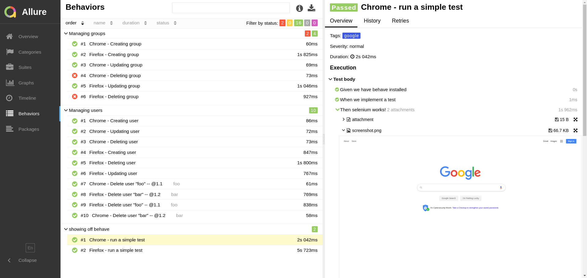

# behave-docker-parallel
------------------------

# TODO

* implement scenarios that actually run in a browser
* run python in worker container as non-root


# Requirements

* docker
* [docker-compose](https://pypi.org/project/docker-compose/)
* [pre-commit](https://pre-commit.com/)
* (optional) [virtualenvwrapper](https://pypi.org/project/virtualenvwrapper/) or [pipenv](https://pypi.org/project/pipenv/)

Create a virtualenv with `virtualenvwrapper`:
```bash
mkvirtualenv -p python3.7 bdp
```

Then for development purposes install all requirements with:
```bash
make requirements
```

## Updating requirements

* Add a new dependency to `requirements.in` without version pinning
* Then compile new `requirements.txt` with [pip-compile](https://pypi.org/project/pip-tools/)

```bash
make compile_requirements
```


# Start Hub & Browsers

Start Selenium Hub and 1 Firefox, 1 Chrome & 2 workers (1 for each browser)
```bash
make containers
```

You can also call `docker-compose` directly:
```bash
docker-compose up --build --scale worker=2
```

Alternatively you can spin up multiple workers and instances of FF and/or Chrome:
```bash
docker-compose up --build --scale firefox=3 --scale chrome=3 --scale worker=6
```


# Run tests

```bash
make tests
```

# Management & Monitoring Consoles

Once all services are up & running you can access:

* Selenium Grid Console [http://localhost:4444/grid/console](http://localhost:4444/grid/console)
* Redis Commander (Redis monitoring tool) [http://localhost:8081/](http://localhost:8081/)


# Allure reports

* Install [allure](https://docs.qameta.io/allure/#_installing_a_commandline)
* or if you're e.g. on Fedora then install [NPM wrapper around allure-commandline](https://www.npmjs.com/package/allure-commandline)
    * `npm install -g allure-commandline --save-dev`

Once all tests are done, the you'll find allure result files in browser specific folders,
e.g.: `chrome_results` & `firefox_results`.
Some of those JSON result files might contain the same `historyId` & `uuid` values.
If you decide to simply merge those folders and generate an allure report from them,
then some of the test results might "disappear" as they will be overwritten by test with the
same `historyId` and/or `uuid`.
In order to address this issue please use `make results` (or `update_results.py` script).
It will prepend a custom prefix (browser name) to aforementioned fields and to the test name.
This turn will make test results unique.

To update result files and move them to the `./results` folder use:
```bash
make results
```

Then you can either serve the report directly from result files with:
```bash
make serve
```

or you can generate a standalone html report with:
```bash
make report
```

Once allure starts up the web server it will open in your default browser,
and thanks to using the prefix, you'll see the tests nicely




# Tips

## List all scenario names

```bash
make scenarios
```


## Finding duplicated scenario names

In order to run all of your scenarios, they have to have a unique name.
If that's not the case then some of the scenarios might not be executed
and/or their results won't be visible in the allure report.

To find duplicated scenario names use:
```bash
make find_duplicated_scenario_names
--- /dev/fd/63	2019-10-07 15:43:06.897083292 +0100
+++ /dev/fd/62	2019-10-07 15:43:06.898083296 +0100
@@ -7,4 +7,3 @@
 Updating group
 Updating user
 run a simple test
-run a simple test
make: *** [makefile:25: find_duplicated_scenario_names] Error 1
```

## Checking health status of Selenium Hub & Browsers

You can check the health status of selenium-hub or selected browser with:

```bash
docker inspect --format='{{json .State.Health.Status}}' selenium-hub
# or
docker inspect --format='{{json .State.Health.Status}}' #BROWSER_INSTANCE_ID
```

or you can use a "get'em all" one-liner that displays health statuses for all
browser instances and selenium-hub in one go:
```
docker inspect --format '{{ .Name }} -> {{ .State.Health.Status }}' \
    $(docker ps -a --format "table {{.Names}}\t{{.ID}}" |\
    grep "chrome\|firefox\|hub" |\
    awk '{printf $NF" "}')
```

btw. you can always create a handy alias for that one-liner:
```bash
alias hh='docker inspect --format "{{ .Name }} -> {{ .State.Health.Status }}" $(docker ps -a --format "table {{.Names}}\t{{.ID}}" | grep "chrome\|firefox\|hub" | awk '"'"'{printf $NF" "}'"'"')'
```
